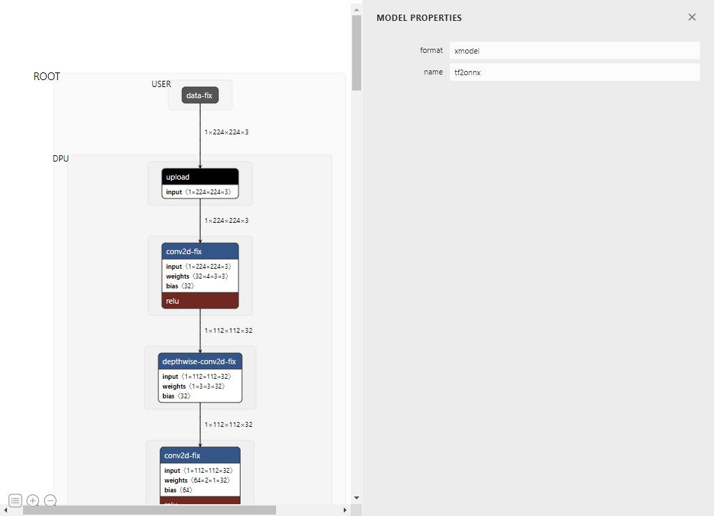

7.6.0 更新：支持 tensor name 搜索，支持 tensor 属性的搜索，支持tensor shape 的搜索，支持 tensor 多属性的高级搜索
搜索shape用法：[n,h,w,c]（中间不带空格）
搜索 reg_id为 1：reg_id: 1 （中间有一个空格）
搜索 reg_id为1 同时 fix_point为3 ：reg_id: 1;fix_point: 3 （中间用分号隔开）

-------------

7.5.8 更新：支持显示 INT64，显示 PDI name
支持

------------

7.4.5 更新：修复data type 为 int 的 tensor 属性显示问题（为了支持qdq的tensor attribute）

----------

7.4.2 更新：修复 tensor strides 显示异常问题；未编译的 xmodel 显示所有 const 和 const-fix（为了显示 qdq 的 zero_point）

--------

7.3.4 更新：增加所有 subgraph ac_code, mc_code, children_topological_sort 等 std::vector<string>, std::vector<char> 的 dump txt, dump bin 功能，对应右下角有一个保存按钮即可保存对应值到文件。（windows 下用 xcd服务器下可能存在方块的显示异常，方块就是保存按钮）

------------

7.2.3更新：修复 subgraph 画框边界问题
关闭自动更新
修复 subgraph 的选中逻辑

----------------

7.1.4 更新：支持 bf16 的 tensor dump 和显示。

---------

7.0.8 更新：node 节点增加 subgraph 的链接显示

-----------------------

7.0.4 更新：修复 bytes 和 map<string, bytes[]> 的显示
修复 tensor 属性的显示，增加 tensor_name 显示

-------------

7.0.3 更新：修复 subgraph sidebar 的滚动问题，优化编译前 const 的显示

------------------------

7.0.0 更新：可以显示 tile subg, int16, bfloat16, uint32 属性

Netron is a viewer for neural network, deep learning and machine learning models. 

Netron supports ONNX, TensorFlow Lite, Core ML, Keras, Caffe, Darknet, MXNet, PaddlePaddle, ncnn, MNN and TensorFlow.js.

Netron has experimental support for PyTorch, TorchScript, TensorFlow, OpenVINO, RKNN, MediaPipe, ML.NET and scikit-learn.

</a>

## Install

**macOS**: [**Download**](https://gitenterprise.xilinx.com/huisu/netron/releases/latest) the `.dmg` file or run `brew install --cask netron`

**Linux**: [**Download**](https://gitenterprise.xilinx.com/huisu/netron/releases/latest) the `.AppImage` file or run `snap install netron`

**Windows**: [**Download**](https://gitenterprise.xilinx.com/huisu/netron/releases/latest) the `.exe` installer or run `winget install -s winget netron`

## Models

Sample model files to download or open using the browser version:

 * **ONNX**: [squeezenet](https://github.com/onnx/models/raw/main/validated/vision/classification/squeezenet/model/squeezenet1.0-3.onnx) [[open](https://netron.app?url=https://github.com/onnx/models/raw/main/validated/vision/classification/squeezenet/model/squeezenet1.0-3.onnx)]
 * **TensorFlow Lite**: [yamnet](https://huggingface.co/thelou1s/yamnet/resolve/main/lite-model_yamnet_tflite_1.tflite) [[open](https://netron.app?url=https://huggingface.co/thelou1s/yamnet/blob/main/lite-model_yamnet_tflite_1.tflite)]
 * **TensorFlow**: [chessbot](https://github.com/srom/chessbot/raw/master/model/chessbot.pb) [[open](https://netron.app?url=https://github.com/srom/chessbot/raw/master/model/chessbot.pb)]
 * **Keras**: [mobilenet](https://github.com/aio-libs/aiohttp-demos/raw/master/demos/imagetagger/tests/data/mobilenet.h5) [[open](https://netron.app?url=https://github.com/aio-libs/aiohttp-demos/raw/master/demos/imagetagger/tests/data/mobilenet.h5)]
 * **TorchScript**: [traced_online_pred_layer](https://github.com/ApolloAuto/apollo/raw/master/modules/prediction/data/traced_online_pred_layer.pt) [[open](https://netron.app?url=https://github.com/ApolloAuto/apollo/raw/master/modules/prediction/data/traced_online_pred_layer.pt)]
 * **Core ML**: [exermote](https://github.com/Lausbert/Exermote/raw/master/ExermoteInference/ExermoteCoreML/ExermoteCoreML/Model/Exermote.mlmodel) [[open](https://netron.app?url=https://github.com/Lausbert/Exermote/raw/master/ExermoteInference/ExermoteCoreML/ExermoteCoreML/Model/Exermote.mlmodel)]
 * **Darknet**: [yolo](https://github.com/AlexeyAB/darknet/raw/master/cfg/yolo.cfg) [[open](https://netron.app?url=https://github.com/AlexeyAB/darknet/raw/master/cfg/yolo.cfg)]
